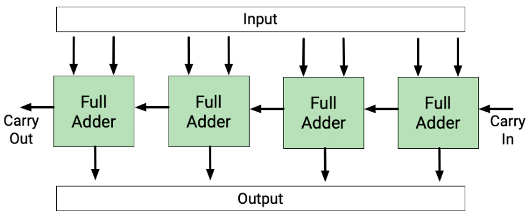
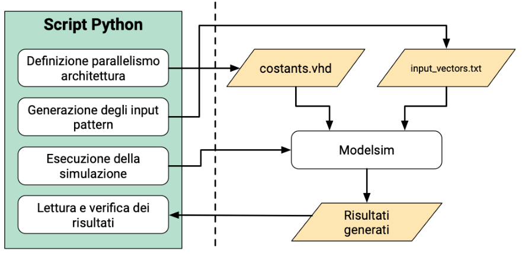

# ISE Lab 5
Laboratorio 5 del corso **Integrazione di Sistemi Embedded** del corso magistrale in Embedde System (Ingegneria Elettronica) del Politecnico di Torino, anno accademico 2018/2019.<br/>

## Esercizio 1
Lo scopo dell'esercitazione è quello di prendere dimestichezza con il linguaggio di scripting **Python**, utilizzandolo per la simulazione automatica di circuiti digitali mediante il software **Modelsim**.<br/>

Dal punto di vista metodologico, sarà necessario creare uno script Python in grado di compilare l'insieme di file VHDL che implementano il circuito sotto esame, di eseguirne la simulazione logica e di verificare la correttezza dei risultati ottenuti.

### Introduzione: il Ripple Carry Adder
Durante l'esercitazione verrà analizzato il comportamento del **Ripple Carry Adder** (RCA). Il circuito viene ottenuto mediante la concatenazione di più sottocircuiti, identici tra loro denominati **Full Adder**. Il full-adder o sommatore completo è un circuito logico caratterizzato da tre ingressi e due uscite.
La sua funzionalità è quella di eseguire una somma tra due numeri espressi in formato binario con lunghezza di parola a un bit.<br/>
In logica binaria esegue questa semplice operazione:
```
A + B + Ci = S + Co
```
dove ``A`` e ``B`` sono gli operandi, ``Ci`` il riporto in ingresso (``Ci`` → Carry in) della precedente somma e ``S`` e ``Co`` sono la somma e il riporto di uscita (``Co`` → Carry out).<br/>

Come mostrato in figura, in un full-adder a "n" bit la struttura col riporto in ingresso esiste per poter eventualmente collegare un numero "n" full-adder in cascata per poter ottenere full-adder a "n" bit.

<p align="center">
  
</p>

### Prima analisi
All'interno dell'archivio sono presenti diversi file: tra questi i file con estensione .vhd rappresentano la descrizione dell'hardware corrispondente all'architettura di un RCA. Nello specifico, *constants.vhd* contiene i parametri comuni a tutto il progetto, in questo caso contiene il parallelismo del sommatore; di default il parallelismo è impostato a 4 bit.<br/>
L'architettura deve essere utilizzata con numeri **unsigned** e il risultato della somma viene rappresentato su *n* bit +1. In questo caso quindi l'architettura vedrà come ingressi due numeri unsigned su 4 bit e genereà come risultato un numero unsigned su 5 bit. Il file con estensione .do contiene le informazioni utili all'esecuzione della simulazione. All'interno di questo script infatti vengono definiti:
- cartella di lavoro, in questo caso *work*;
- compilazione gerarchica (dal blocco gerarchicamente inferiore a salire);
- definizione del testbench, in questo caso *rca_tb.vhd*;
- definizione del tempo di simulazione, di default impostare questo valore a 10ms (attenzione: aumentando il parallelismo dell'architettura, questo tempo potrebbe non essere sufficiente a testare tutte i possibili pattern di ingresso, di conseguenza, nel caso in cui sia necessario, modificare questo parametro);
- chiusura della simulazione.

Come primo step dell'esercitazione, provare ad eseguire lo script *lab05.py*.
Prima dell'esecuzione aprirlo per comprenderne il funzionamento. Per eseguirlo utilizzare un qualunque editor grafico (ad esempio Ecplise + PyDev) oppure eseguirlo con il comando:
```bash
python lab05.py
```
Attenzione: il server di default utilizza la versione di Python 2.7.5. Per essere sicuri di utilizzare la corretta versione di python impostare l'alias:
```bash
alias python=python3.6
```
oppure specificare la versione dell'interprete:
```
python3.6 lab05.py
```
L'architettura descritta viene definita secondo il parallelismo indicato nel file *constants.vhd* (in questo caso 4 bit). I pattern testati come ingresso sono indicati nel file *input_vectors.txt*.<br/>
Dopo l'esecuzione dello script *la05.py* viene generato il file *output_results.txt*.
Verificare manualmente che i risultati siano coerenti con gli ingressi.

### Modifica dello script
Come secondo step, modificare lo script Python esistente come mostrato in figura in modo da:
1. Generare tutte le possibili combinazioni di ingressi (in modo ordinato). Di conseguenza lo script deve essere in grado di generare il file di ingresso *input_vectors.txt* contenente tutti i possibili input pattern.
2. Eseguire nuovamente la simulazione.
3. Verificare che i risultati generati nel file *output_results.txt* siano corretti da un punto di vista logico. Nel caso in cui una o più combinazioni di ingressi producano un risultato errato, queste devono essere riportate in un file *log.txt*.

<p align="center">
  
</p>

### Simulazioni parametriche
Lo stesso processo indicato nella sezione precedente e mostrato in figura deve essere iterato modificando il parallelismo dell'architettura.<br/>
Al fine dell'esercitazione, ripetere i punti 1, 2 e 3 per i parallelismi: 2, 4, 8 bit. Di conseguenza è necessario creare un ciclo esterno che permetta di risolvere il problema in modo generico, testando i tre parallelismi richiesti.
Lo script dovrà eseguire in automatico le tre simulazioni, modificando di volta in volta il contenuto del file *constants.vhd*. Per ciascuna iterazione, memorizzare i tre file di ingresso e i tre file di uscita corrispondenti alle tre configurazioni. Di conseguenza dovranno essere generati i file:
```
input_vectors_2bit.txt
output_results_2bit.txt
input_vectors_4bit.txt
output_results_4bit.txt
input_vectors_8bit.txt
output_results_8bit.txt
```
Lo script finale dovrà produrre un unico *log.txt* contente il nome delle architetture e per ciascuna di esse gli eventuali pattern che hanno generato risultati errati (nel caso in cui tutti i risultati siano correnti, indicare esplicitamente che l'esecuzione dello script non ha verificato la presenza di errori).
