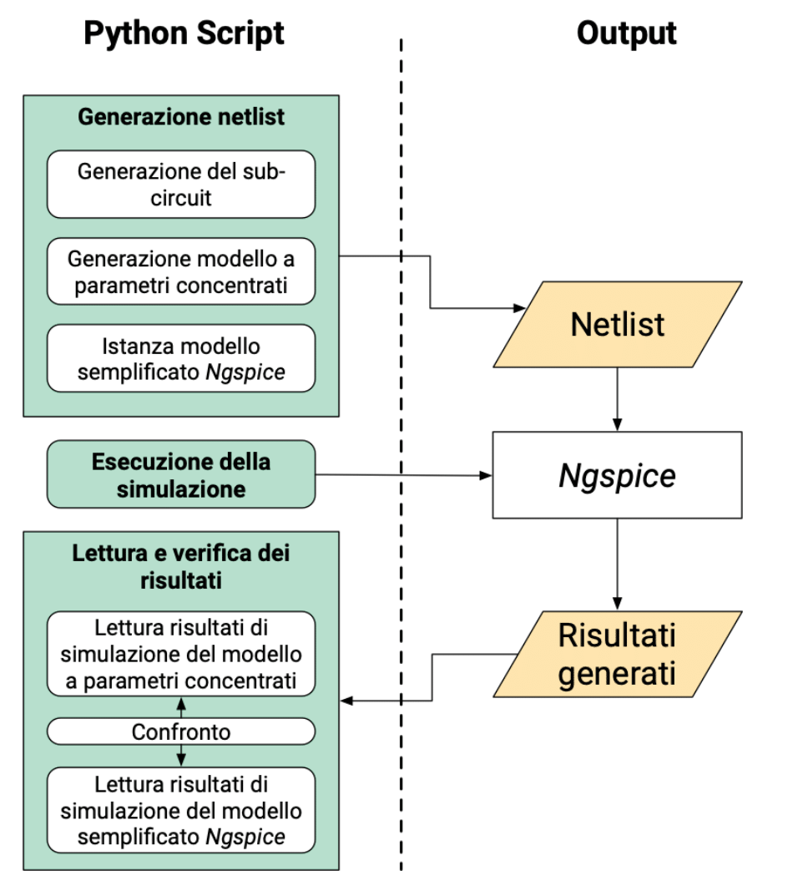
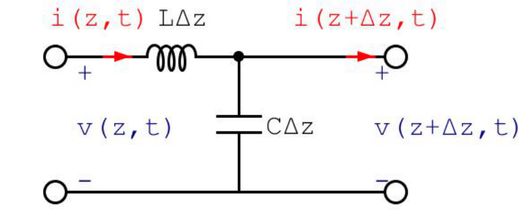
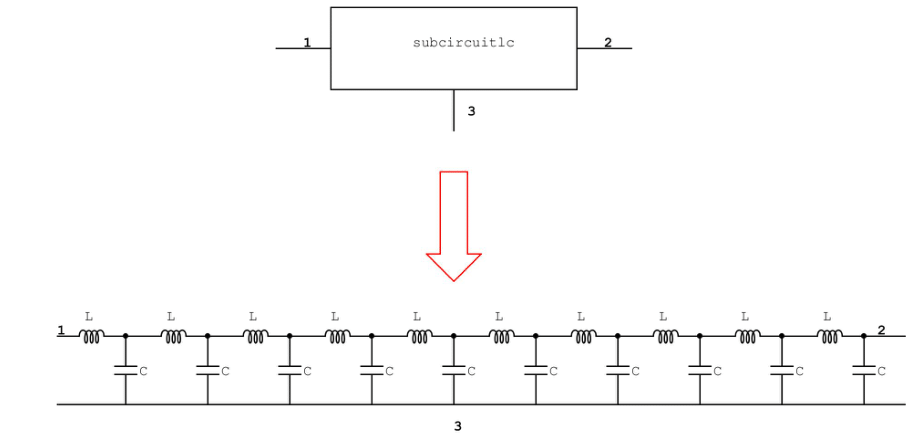
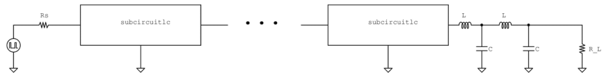
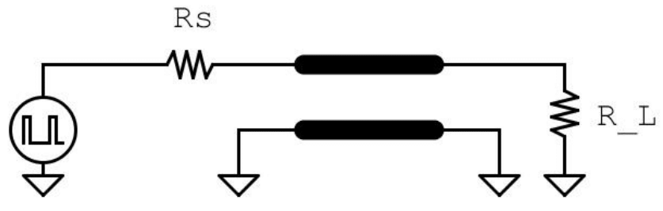
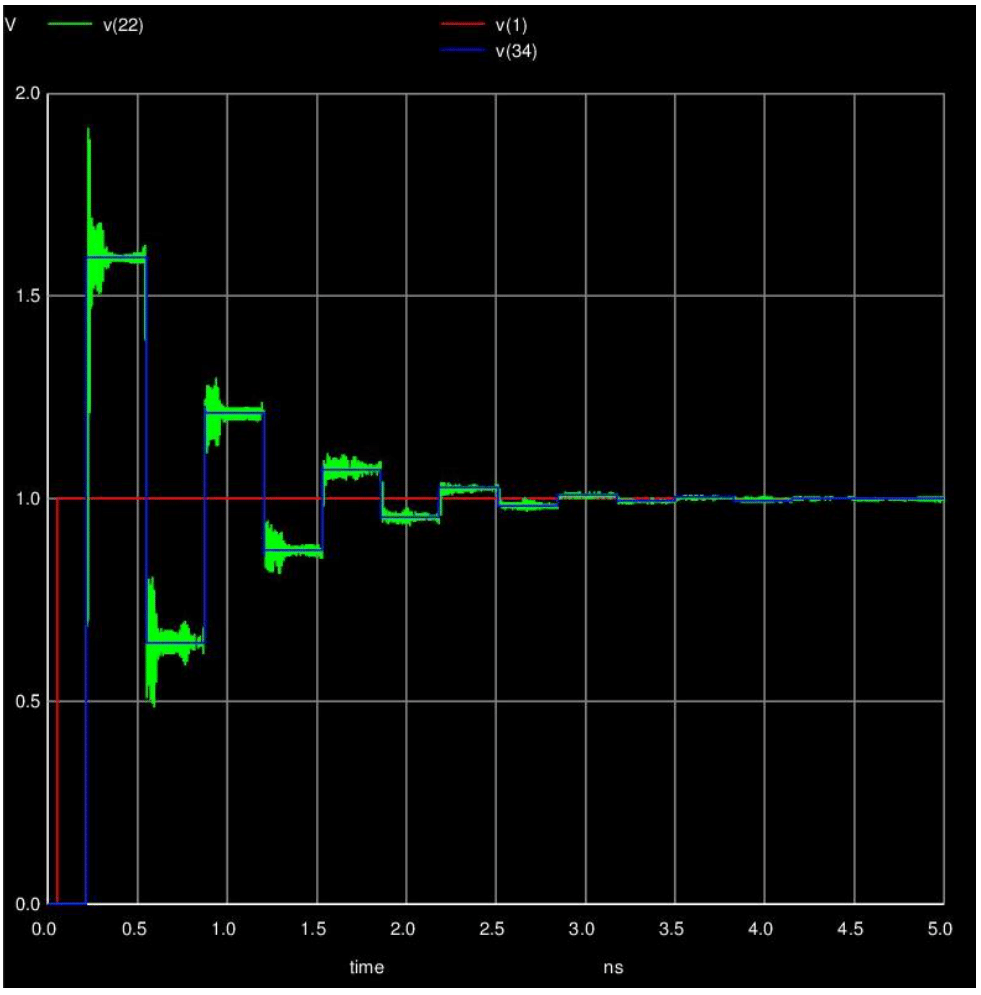

# ISE Lab 6
Laboratorio 6 del corso **Integrazione di Sistemi Embedded** del corso magistrale in Embedde System (Ingegneria Elettronica) del Politecnico di Torino, anno accademico 2018/2019.<br/>

## Esercizio 1
Lo scopo dell'esercitazione è quello di prendere domestichezza con il linguaggio di scripting **Python** utilizzandolo per la simulazione automatica mediante
**Ngspice** di circuiti analogici.<br/>
Ngspice è un simulatore mixed-level/mixed-signal di circuiti. 
È un software open source disponibile per diverse piattaforme e basato su tre software packages: Spice3f5, Xspice and Cider1b1.<br/>
Durante il laboratorio verranno descritte e analizzate due linee di trasmissione, una basata sul modello semplificato interno al software e una basata sul circuito equivalente a parametri concentrati.<br/>
Dal punto di vista metodologico, sarà necessario creare uno script python in grado di generare una netlist Ngspice al fine di simulare il comportamento delle due linee di trasmissione. I risultati dovranno essere raccolti e confrontati verificandone il comportamento asintotico delle due simulazioni.

<p align="center">
  
</p>

### Introduzione
La differenza fondamentale tra un circuito a parametri concentrati ed uno a parametri distribuiti è legata al rapporto tra le dimensioni del circuito e la lunghezza d'onda `λ` dei segnali elettrici in esso circolanti. Dato un circuito unidimensionale - posto lungo l'asse cartesiano `z` - di lunghezza `L`, esso è considerato a parametri concentrati se `λ >> L`, altrimenti è da trattare con un modello a parametri distribuiti. Nel primo caso è ragionevole supporre che una variazione di un segnale elettrico in un determinato istante tempo-reale `t` sia percepita da tutto il circuito nello stesso istante, nell'altro essa è percepita differentemente da punti diversi del circuito, pertanto le grandezze elettriche dipenderanno non solo dal tempo `t` ma anche dalla posizione `z`.<br/>
Un'importante conseguenza della distinzione di cui sopra riguarda la metodologia di analisi di un circuito: se vale il modello a parametri concentrati, è ammessa l'analisi delle grandezze elettriche attraverso l'applicazione delle leggi di Kirchhoff, altrimenti sarà necessario ricorrere alle equazioni di Maxwell.<br/>
Una linea di trasmissione è di solito schematizzata con due fili conduttivi separati da un materiale dielettrico. Supponendo che una linea di trasmissione sia senza perdite ohmiche nei conduttori e nel dielettrico, essa può essere scomposta in segmenti di lunghezza `Δz`, ciascuno descritto da un circuito a parametri concentrati, dove  e  sono l'induttanza e la capacità per unità di lunghezza rispettivamente.

<p align="center">
  
</p>

Le equazioni caratteristiche delle linee di trasmissione non sono nient'altro che le equazioni differenziali ottenute scomponendo la linea in segmenti di lunghezza infinitesima .

<p align="center">

</p>

Le soluzioni generali delle equazioni di una generica linea di trasmissione sono:

<p align="center">

</p>

dove gli apici `+` e `-` si riferiscono alle onde incidente e riflessa - le quali si muovono lungo la linea con velocità di propagazione v in direzione `+z` e `-z` rispettivamente - nell'istante temporale `t` e Z<sub>0</sub> è chiamata impedenza caratteristica di valore

<p align="center">

</p>

È possibile dimostrare che la velocità di propagazione tra due punti  e  è pari a

<p align="center">

</p>

e di conseguenza il ritardo di propagazione sarà ottenuto come

<p align="center">

</p>

Se si considera una linea di lunghezza `L`, il ritardo di propagazione tra le due estremità sarà pari a

<p align="center">

</p>

Non essendo possibile simulare su un calcolatore una catena infinita di celle LC di lunghezza infinitesima e risolvere in maniera esatta un calcolo integrale per la stima del ritardo di propagazione, in questa esercitazione si intende simulare una linea di trasmissione costituita da una catena finita di elementi capacitivi ed induttivi a parametri concentrati, pertanto si suppone che ciascun segmento abbia lunghezza finita  anzichè infinitesima , una capacità  ed un'induttanza  dai cui valori dipende il valore dell'impedenza caratteristica

<p align="center">

</p>

È possibile definire per ciascuna cella LC un ritardo di propagazione  e il ritardo complessivo lungo una linea di  elementi viene calcolato da una sommatoria anzichè da un integrale:

<p align="center">

</p>

### Generazione della netlist
#### Generazione del sub-circuit
Generare la netlist del subcircuit denominato *subcircuitlc.txt* comprensivo di 10 elementi della catena come rappresentato in figura. Utilizzare come valore di capacità e induttanza `C = 0.02 pF` e `L = 0.05 nH` rispettivamente.

<p align="center">
  
</p>

#### Istanza dei sub-circuit
Generare una netlist, considerando un ritardo  in picosecondi, con risoluzione di 1 ps (p.e. 123 ps o 124 ps sono ammessi a differenza di 123.7 ps).
Il ritardo deve essere inserito dall'utente tramite line di comando.<br/>
Si richiede di massimizzare l'impiego dei sub-circuit. Nel caso in cui il ritardo non fosse ottenibile adoperando unicamente i sub-circuit, istanziare il numero opportuno di celle LC all'interno dello script.

<p align="center">
  
</p>

#### Generatore di ingresso
Configurare come generatore di ingresso della netlist, un gradino di tensione con tensione tra 0V e 1V, con un fronte di salita sull'istante temporale pari ad  del ritardo di propagazione richiesto. Sia fissato il tempo disalita al valore .<br/>
Collegare in serie al generatore di ingresso una resistenza di valore 

#### Valori di carico
Considerare tre diversi valori di carichi resistivi:
1. carico adattato ;
2. carico adattato ;
3. circuito aperto .

Generare una netlist per ciascun valore di . Il nome di ciascuna netlist deve essere composto come: *netlisttxline< valore R<sub>L</sub> >.txt*, pertanto dovranno essere generati tre file denominati:
```
netlisttxline50.txt
netlisttxline12-5k.txt
netlisttxline100meg.txt
```
Per tutti i valori di carico sopra elencati, misurare la tensione di uscita.

#### 4.5 Istanza del circuito equivalente
Inserire all'interno della stessa netlist, un circuito equivalente al precedente in cui è presente il componente della linea di trasmissione interno a *ngspice* da utilizzare come termine di confronto per le analisi sul circuito a parametri concentrati.

<p align="center">
  
</p>

#### Simulazione
Eseguire un'analisi in transitorio considerando un *time-step* di 0.1 ps e un tempo di simulazione di 5 ns. La simulazione deve essere lanciata in *batch mode*. Memorizzare i risultati generati dalla simulazione in un file di testo il cui nome deve essere composto come *res< valore R<sub>L</sub> >.txt*; di conseguenza dovranno essere generati tre file denominati:
```
res50.txt
res12-5k.txt
res100meg.txt
```
Su ciascun file di uscita devono essere memorizzati:
- Valore della tensione di ingresso presente sul generatore
- Valore della tensione di uscita del circuito a parametri concentrati
- Valore della di uscita del circuito di confronto descritto nel paragrafo precedente

Salvare anche il corrispondente grafico della forma d'onda su tre file distinti denominati *res50.ps*, *res12-5k.ps* e *res100meg.ps*.

#### Analisi dei risultati
A seguito dell'esecuzione della simulazione, dovrebbero essere stati generati i file contenenti la rappresentazione testuale grafica delle waveform. In figura è riportato un esempio di plot considerando un carico  e 

<p align="center">
  
</p>

Elaborare i file *res50.txt*, *res12-5k.txt* e *res100meg.txt* calcolando:
1. Il ritardo di propagazione  della prima transizione in presenza di **carico adattato** (solo per la configurazione )
2. Per ciascun intervallo successivo  di durata , verificare che il valore medio della tensione di uscita del circuito a parametri concentrati è confrontabile con il valore asintotico ottenuto come uscita del circuito di confronto. Considerare come intervallo di integrazione, valori compreso tra  e .

Generare un log-file in cui venga riportato (per ogni valore di ).
1. Il valore di  calcolato
2. Per ciascuna iterazione indicare:
    - Il valore medio della tensione di uscita del circuito a parametri concentrati nell'intervallo di integrazione indicato nel punto 2
    - Il valore di tensione di uscita misurato sul modello semplificato della linea di trasmissione
    - Il calcolo dell'errore relativo tra le due misurazioni
  
##### Esempio di log-file:
```
load = 50
Iteration | Vref       | Vout           | Relative Error
0         | 0.8        | 0.80004620263  | err = 0.01 %
1         | 0.8        | 0.799960175991 | err = 0.00 %
2         | 0.8        | 0.799987214024 | err = 0.00 %
3         | 0.8        | 0.800002798438 | err = 0.00 %
4         | 0.8        | 0.799997199085 | err = 0.00 %
5         | 0.8        | 0.800001624733 | err = 0.00 %
6         | 0.8        | 0.799999463529 | err = 0.00 %
7         | 0.8        | 0.799996220465 | err = 0.00 %
8         | 0.8        | 0.800000633651 | err = 0.00 %
9         | 0.8        | 0.7999989125   | err = 0.00 %
10        | 0.8        | 0.800000202515 | err = 0.00 %
11        | 0.8        | 0.800001457203 | err = 0.00 %
12        | 0.8        | 0.800001320503 | err = 0.00 %
13        | 0.8        | 0.799999995503 | err = 0.00 %
Evaluated td = 1.6522998e -10

load = 100 meg
Iteration | Vref       | Vout           | Relative Error
0         | 1.599999   | 1.60026667759  | err = 0.02 %
1         | 0.6400006  | 0.640172153916 | err = 0.03 %
2         | 1.215999   | 1.21651644348  | err = 0.04 %
3         | 0.8704004  | 0.870339013178 | err = 0.01 %
4         | 1.077759   | 1.07782411305  | err = 0.01 %
5         | 0.9533442  | 0.952669019993 | err = 0.07 %
6         | 1.027993   | 1.02817357008  | err = 0.02 %
7         | 0.9832039  | 0.983331434599 | err = 0.01 %
8         | 1.010077   | 1.0098945498   | err = 0.02 %
9         | 0.9939533  | 0.994103257257 | err = 0.02 %
10        | 1.003628   | 1.00324445154  | err = 0.04 %
11        | 0.9978231  | 0.997980257576 | err = 0.02 %
12        | 1.001306   | 1.0012842663   | err = 0.00 %
13        | 0.9992162  | 0.999231719351 | err = 0.00 %

load = 12.5 k
Iteration | Vref       | Vout           | Relative Error
0         | 1.593625   | 1.59388991768  | err = 0.02 %
1         | 0.6450691  | 0.645233368631 | err = 0.03 %
2         | 1.209668   | 1.2101735535   | err = 0.04 %
3         | 0.873608   | 0.873549610316 | err = 0.01 %
4         | 1.073637   | 1.07370388286  | err = 0.01 %
5         | 0.954576   | 0.953906934107 | err = 0.07 %
6         | 1.025444   | 1.02563612279  | err = 0.02 %
7         | 0.9832619  | 0.983379485447 | err = 0.01 %
8         | 1.008369   | 1.00823884498  | err = 0.01 %
9         | 0.9934248  | 0.993509191082 | err = 0.01 %
10        | 1.00232    | 1.0020503895   | err = 0.03 %
11        | 0.9970254  | 0.997217201835 | err = 0.02 %
12        | 1.000177   | 1.00013974905  | err = 0.00 %
13        | 0.9983011  | 0.998300620346 | err = 0.00 %
```

[//]: # (https://tex-image-link-generator.herokuapp.com/)
