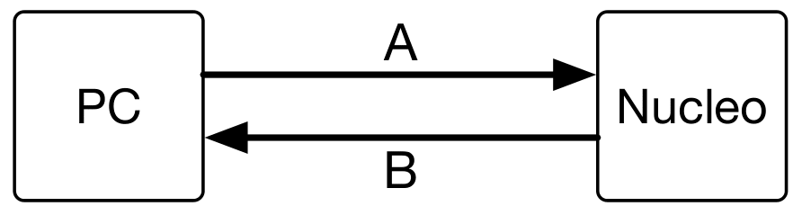

# ISE Lab 7
Laboratorio 7 del corso **Integrazione di Sistemi Embedded** del corso magistrale in Embedde System (Ingegneria Elettronica) del Politecnico di Torino, anno accademico 2018/2019. 

## Esercizio 1
Lo scopo dell'esercitazione è quello di realizzare un misuratore di riflessi stabilendo una comunicazione mediante interfaccia seriale tra la scheda Nucleo F401RE e il PC.

  

Sul PC deve essere eseguito uno script Python in grado di inviare tramite protocollo seriale i comandi di accesione/spegimento LED.
- "L 1": accende il LED
- "L 0": spegne il LED

Non è da considerarsi corretto il caso in cui venga mandato il comando di accensione (o spegnimento) LED quando questo è già acceso (o spento) sulla Nucleo.  
Il programma deve poter essere utilizzato sia tramite linea di comando che tramite interfaccia grafica.
La comunicazione seriale deve essere impostata con i seguenti parametri:
- Baudrate = 115200
- No parity
- No handshake
- Bytesize = 8bit

I comandi devono essere inviati con un ritardo casuale di 10-20 secondi.  
Una volta inviati i comandi di accensione e spegnimento LED, la scheda Nucleo deve interpretarli ed eseguirli.
La scheda Nucleo deve occuparsi di misurare il tempo trascorso dall'istante in cui il LED è stato acceso (o spento) a quello in cui il bottone presente sulla scheda Nucleo viene premuto.  
Il tempo, espresso in `ms` in esadecimale deve essere inviato mediante interfaccia seriale al PC (usando la sintassi `Thhhh`) e letto dallo script Python il quale mostrerà all'utente il tempo di riflesso misurato in `ms` in decimale.
